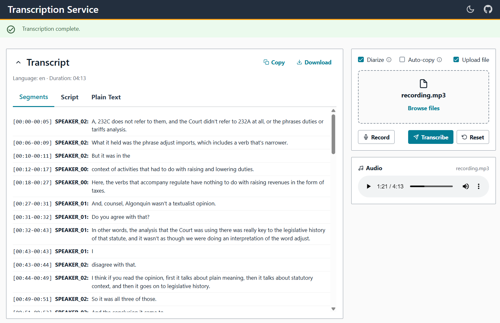

# Transcriber UI

React + TypeScript front-end for the Transcriber server. Handles audio upload, browser microphone recording, and displays streamed transcription results. Built with Vite and served directly by the FastAPI server from its `static/` directory.

<div align="center">

</div>

---

## Stack

| Area | Library | Version |
|------|---------|---------|
| UI framework | React | ^19.2.0 |
| Component library | AWS Amplify UI React | ^6.15.1 |
| Build tool | Vite | ^7.3.1 |
| Language | TypeScript | ~5.9.3 |
| Icons | react-icons | ^5.6.0 |
| PWA | vite-plugin-pwa | ^1.0.0 |
| Tests | Vitest + Testing Library | ^4.0.18 / ^16.3.2 |

---

## Directory structure

```
ui/
├── src/
│   ├── api/          SSE streaming API call
│   ├── context/      Global state provider + useTranscriber hook
│   ├── components/   UI components (upload, recorder, player, transcript views)
│   └── utils/        Formatting and file export utilities
├── public/
│   └── icons/        PWA icons
└── ...               Configs and build scripts
```

---

## Development

```bash
cd ui
npm install
npm run dev       # Vite dev server on http://localhost:5173 (API proxied to :8080)
npm run test      # Vitest (single run)
npm run test:watch
npm run lint
npm run typecheck
```

The dev server proxies `/transcribe/**` and `/health/**` to `http://127.0.0.1:8080` (see `vite.config.ts`). Start the Python server first:

```bash
# In the repo root
uv run trans-server --port 8080
```

---

## Building for production

The build scripts install dependencies, run tests, then call `npm run build`. Output lands in `../src/transcriber/server/static/`, which is the path the FastAPI server mounts.

```bash
# Windows
.\build.bat

# Linux / macOS
./build.sh
```

For a manual build without tests:

```bash
npm run build
```

To override the output directory:

```bash
VITE_OUT_DIR=/some/other/path npm run build
```

Vite routes build artifacts into typed subdirectories (`js/`, `css/`, `img/`, `fonts/`) via Rollup `assetFileNames`/`chunkFileNames`.

---

## API communication

The app has a single API call: `transcribeFileSSE` in `src/api/transcribe.ts`. Everything goes over one endpoint using the browser's `fetch` API with an `AbortSignal` for cancellation.

```
POST {apiBase}/transcribe/stream[?diarize=true]
Content-Type: multipart/form-data
Body: FormData { file: File }
```

**Response:** a chunked SSE stream. The client reads `res.body.getReader()` in a loop and splits on `"\n\n"` boundaries. Three event types are handled:

| Event | Payload | Action |
|-------|---------|--------|
| `progress` | `{ stage: string, message: string }` | Updates status message |
| `complete` | `TranscribeResponse` | Stores result, transitions to `"done"` |
| `error` | `{ detail: string }` | Transitions to `"error"` |

If the `AbortSignal` fires (user hits Cancel), the `DOMException` with name `"AbortError"` is caught and the status is reset to `"idle"`.

**API base URL:** resolved from `window.__SERVER_CONFIG__?.apiBaseUrl ?? "."`. This object is injected into `index.html` by the Python server's `ui.py::mount_ui()` at serve time, allowing the app to work under any URL prefix. In development the proxy makes the relative paths work without any config injection.

---

## State management

All application state lives in `TranscriberContext` (`src/context/TranscriberContext.tsx`). Every component reads from it via `useTranscriber()`. There is no external store — just `useState` and `useRef` inside the provider.

### Persisted settings

Stored under the `"transcriber-settings"` key in `localStorage`. Loaded once on mount and saved on every change.

| Field | Type | Default |
|-------|------|---------|
| `diarize` | `boolean` | `false` |
| `autoCopy` | `boolean` | `false` |
| `transcriptCollapsed` | `boolean` | `false` |
| `showDropzone` | `boolean` | `true` |
| `darkMode` | `boolean` | `false` |

### Transient state

| Field | Type | Notes |
|-------|------|-------|
| `audioFile` | `File \| null` | Set by upload or recorder |
| `status` | `"idle" \| "transcribing" \| "done" \| "error"` | Drives conditional rendering |
| `stage` | `string` | Current SSE stage name |
| `message` | `string` | Displayed in StatusBar |
| `transcript` | `TranscribeResponse \| null` | Set on `complete` SSE event |
| `view` | `"segments" \| "script" \| "plain"` | Active transcript tab |
| `isRecording` | `boolean` | Managed by AudioRecorder |

`abortRef` (`useRef<AbortController | null>`) is not exposed — it is only used internally by `submit()` and `cancel()`.

### Actions

- **`submit()`** — creates an `AbortController`, sets `status="transcribing"`, calls `transcribeFileSSE`. On `complete`, calls `copyToClipboard(toPlainText(result))` if `autoCopy` is set.
- **`cancel()`** — calls `abort()` on the current controller.
- **`reset()`** — calls `cancel()` then resets all transient state to initial values.

---

## PWA

Configured in `vite.config.ts` via `vite-plugin-pwa`:
- `registerType: "autoUpdate"` — SW registration is inlined into `index.html` (no extra `registerSW.js`).
- `workbox.globPatterns: []` — no assets are precached. The app requires the backend to function, so an empty SW is enough to satisfy Chrome's installability criteria.
- `navigateFallback: null` — no offline fallback page.
- Manifest: name `"Transcription Service"`, short name `"Transcriber"`, `display: "standalone"`, `theme_color: "#232f3e"`.
- `start_url: "./"` and `scope: "./"` are relative to the manifest URL, which makes the PWA work under any URL prefix.
- Icons shipped: `icon-192.png`, `icon-512.png`, `icon.svg` (in `public/icons/`).

The Python server's `ui.py` serves `sw.js` and `manifest.webmanifest` at the app root path (not under `/static/`) to maintain the correct service-worker scope.

---

## Dark mode

`darkMode` is a persisted boolean in `TranscriberContext`. `AppShell` derives `colorMode` (`"light"` / `"dark"`) from it and passes it to Amplify's `<ThemeProvider colorMode={...}>`. The toggle button in the header calls `setDarkMode(!darkMode)`. Amplify's `defaultDarkModeOverride` plus the CSS custom properties in `amplify-overwrite.css` handle the visual switch.
